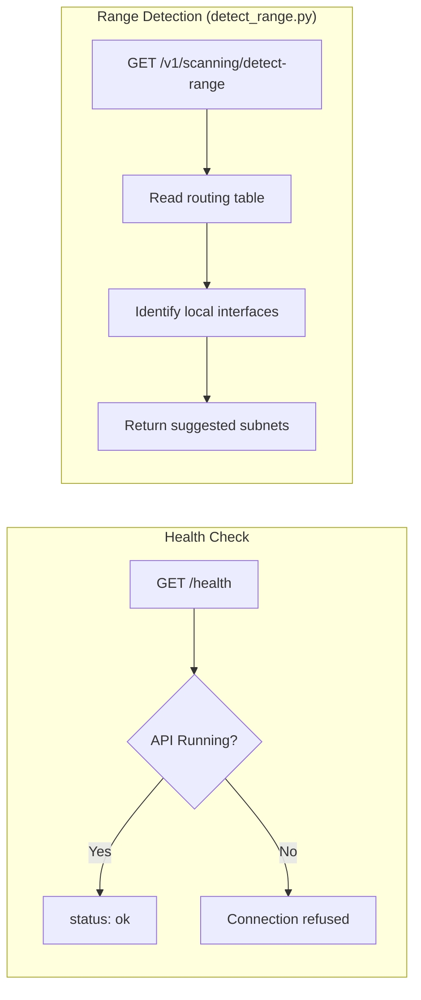
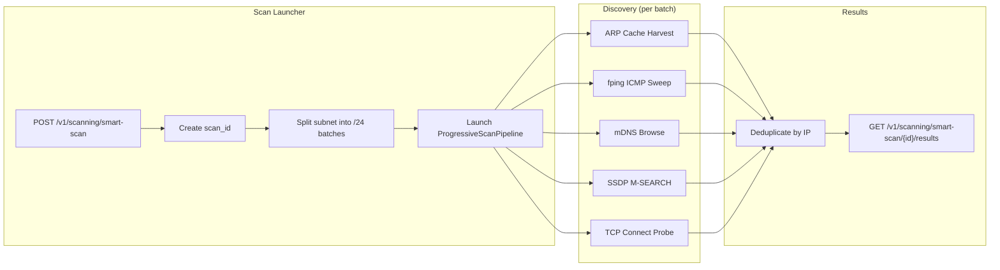
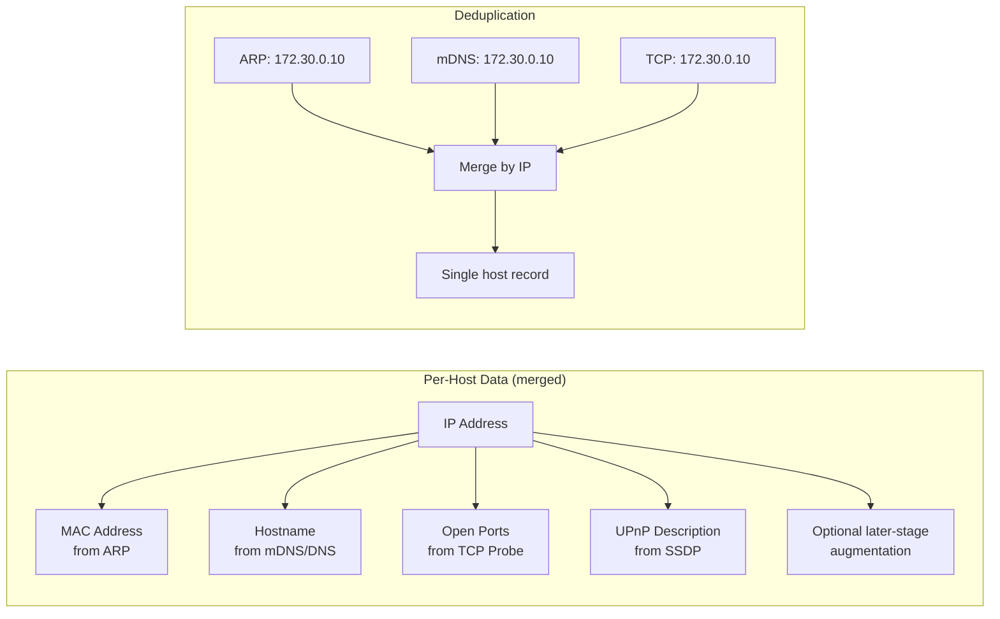
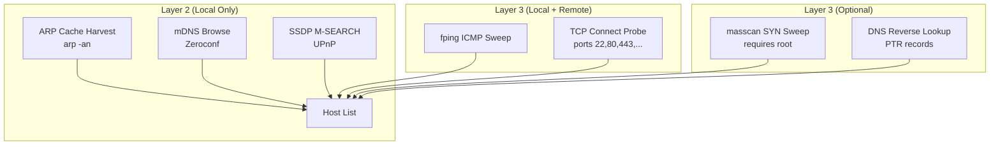
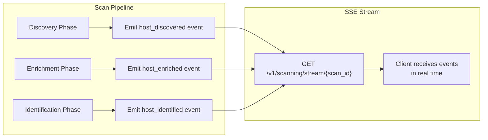
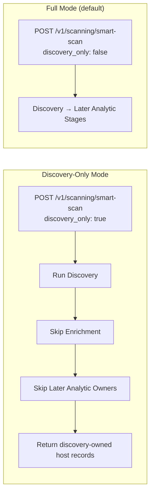
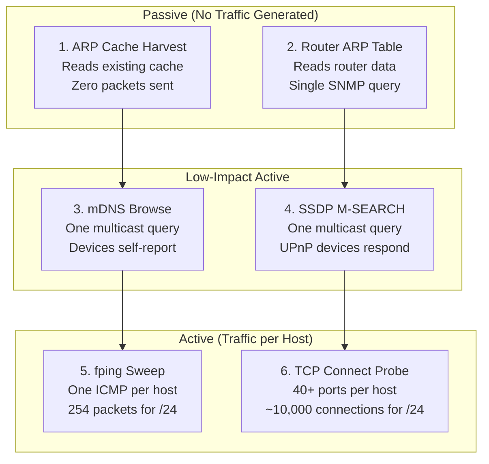
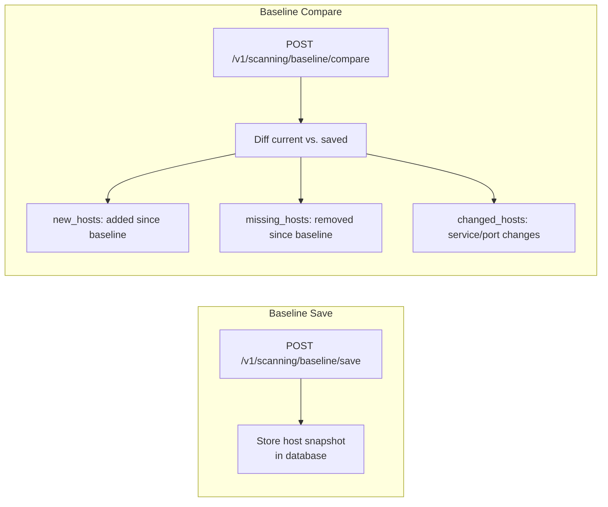
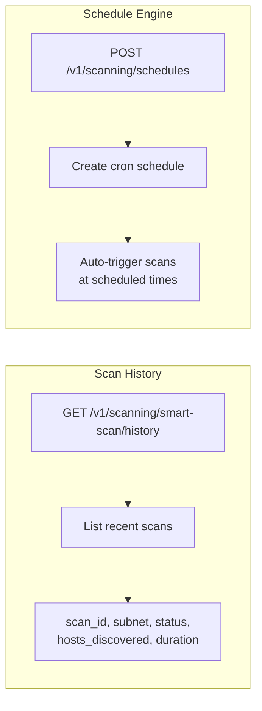
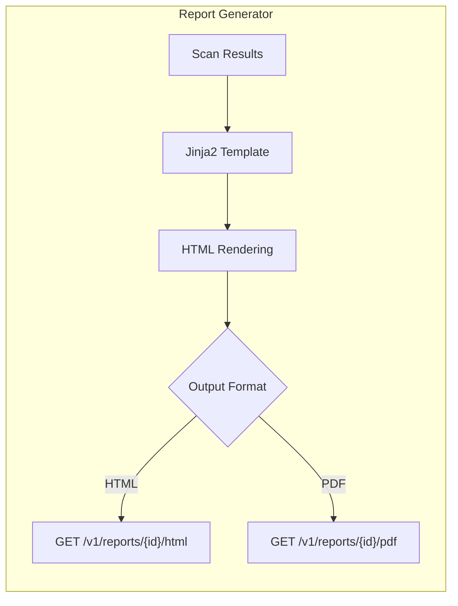

# Breakwater Phase 1: Network Discovery and Asset Inventory Lab

## Descriptive Analytics -- Inventorying the Network Population

Phase 1 introduces the network discovery layer of the Breakwater progressive scan pipeline: ARP cache harvesting, ICMP (`fping`) sweeping, mDNS multicast browsing, SSDP/UPnP discovery, TCP connect probing, subnet auto-detection, router ARP table scraping, and passive-versus-active discovery trade-offs. These techniques form the foundation for all subsequent phases. The lab is discovery-owned: later phases may appear as brief handoff context, but the lesson here is how to observe, structure, and evaluate the network population itself.

Within the SEAS-8414 analytics taxonomy (Chapter 1, Section 1.1), this lab is **descriptive analytics** in its purest form: *inventory the population before any analysis begins*. Every subsequent analytical stage depends on the completeness and accuracy of this inventory:

```
Descriptive   (Ch 1, this lab)  "What devices exist on the network?"
Diagnostic    (Ch 2, Lab 2)     "What are these devices doing?"
Detective     (Ch 3, Lab 3)     "What vulnerabilities do they have?"
Predictive    (Ch 4, Lab 4)     "What attack paths are likely?"
Prescriptive  (Ch 5, Lab 5)     "What offensive tests should we run?"
Simulation    (Ch 6, Lab 6)     "What happens if we apply this fix?"
Autonomous    (Ch 7-12)         "Act on it"
```

The analytical tools you will practice in this lab include set operations (deduplication across seven discovery methods), network layer analysis (L2/L3/L4), heuristic optimisation (pilot probe sampling), streaming pipeline design (producer-consumer queues), and discovery-quality reasoning. The output is a structured dataset -- one record per host with IP, MAC, OUI vendor, hostname, provenance, and discovery method -- that feeds every downstream chapter.

---

<!-- chapter-sync-2026-05-03:start -->
## Mapping This Lab to the Revised Chapter 1

Treat every exercise as evidence construction, not button-clicking. The revised Chapter 1 prescribes a five-step lab workflow in Section 1.15 (*Student Lab Bridge: From Specification to Observation*), and this lab implements that workflow:

1. **Load the simulation ground truth.** `student-lab/ground-truth.json` declares 26 simulated devices on `172.30.0.0/24`. Treat that file as the declared simulation population, never as scan evidence.
2. **Configure the discovery methods.** Decide which of ARP, mDNS, SSDP, fping, masscan, router-side DHCP/SNMP, and bounded TCP probing the environment and policy permit.
3. **Run the discovery scan and record admitted host claims.** What the pipeline admits — with source method, timestamp, and vantage point — is your measured population.
4. **Compare admitted hosts to ground truth.** Note both detections and misses.
5. **Document false positives and incomplete findings.** Reflect on which methods contributed to coverage and which produced misleading silence.

Two reminders before you start:

- **Section numbering in the revised chapter.** Numbering skips (no §1.3 or §1.6); the passive-first discussion is folded into §1.5 (Table 1.6 still appears there), and the Chapter 1 output contract moved to §1.21. Where this lab cites a section, follow the *topic* — copies of the chapter on different dates may show different numbers.
- **Practitioner transfer.** In a production network, run discovery only on approved VLANs and sites, begin with passive and low-disturbance methods, coordinate scan windows with stakeholders, and document the visibility gap instead of hiding it behind a clean inventory table.
<!-- chapter-sync-2026-05-03:end -->

## What to Expect

**What you will do:** Run 10 hands-on exercises using the Breakwater API to discover, examine, and inventory IoT devices on a simulated network. You will launch scans, stream real-time events, compare discovery methods, manage baselines, and generate audit-ready reports.

**How long it takes:** Approximately 2-3 hours, including reading time and answering questions. Individual exercises range from 5-20 minutes. Scan wait times (2-5 minutes per full scan) are built in.

**What you will learn:**
- How to operate a multi-method network discovery pipeline via REST API
- The trade-offs between passive (ARP cache, mDNS) and active (fping, TCP probe) discovery
- How deduplication and merge strategies combine results from seven discovery sources
- How to save network baselines and detect changes (new, missing, or changed hosts)
- How to generate structured asset inventories for security audits

**How to work through the lab:**
- Treat every exercise as a claim-testing exercise, not a button-clicking exercise.
- Before each exercise, write a one-sentence hypothesis.
- After each exercise, record:
  - what evidence appeared,
  - what remained uncertain,
  - what the evidence justified,
  - and what it still did not justify.
- When you compare methods, do not ask only "which found more?"
- Also ask:
  - what kind of world can this method see,
  - what kind of silence can it mislead me about,
  - and what packet or disturbance cost did it impose?
- If a result surprises you, do not immediately "fix" it.
- First ask whether the surprise is evidence of topology, timing, method limitations, or a real environmental change.

**Prerequisites:**
- Docker and Docker Compose installed
- `jq` installed (`brew install jq` on macOS, `apt install jq` on Linux)
- `curl` installed (included in macOS and most Linux distributions)
- Basic understanding of IP networking (subnets, CIDR notation, ARP, ICMP)
- **Chapter 1 of the textbook read** -- particularly Sections 1.1 (Why Discovery Comes First), 1.6 (Passive-First as an Ordering Principle), and 1.7 (ARP Cache Harvesting). See also the Chapter 1 appendix support notes for operational context
- The Breakwater student lab environment running (see Setup below)

---

## Lab Environment Setup

The student lab uses Docker Compose to run the Breakwater API server and a network of 26 simulated IoT devices on a dedicated Docker network (`iotsim-net`, subnet `172.30.0.0/24`). The declared population of 26 includes some cloud-style devices that expose no local service ports; expect discovery to admit a smaller subset.

```bash
# Navigate to the student lab directory
cd student-lab/

# Start the lab environment
docker compose up -d

# Wait 30 seconds for all containers to initialise
sleep 30

# Verify all containers are running
docker compose ps
```

**What you should see:**

```
NAME                STATUS
breakwater-api      Up 30 seconds (healthy)
iot-camera-01       Up 30 seconds
iot-camera-02       Up 30 seconds
iot-nas-01          Up 30 seconds
iot-router-01       Up 30 seconds
iot-sensor-01       Up 30 seconds
...
```

**Register an account and capture your authentication token:**

> The lab uses `student@example.com` because pydantic v2 (the API's request-body validator) rejects the `.local` TLD as a special-use name (RFC 6762). Any RFC 2606 example domain works; we standardize on `example.com`.

```bash
# Register a new user account
TOKEN=$(curl -s -X POST http://localhost:8100/v1/auth/register \
  -H "Content-Type: application/json" \
  -d '{"email":"student@example.com","password":"SecurePass!2026","full_name":"Lab Student"}' \
  | jq -r '.access_token // empty')
if [ -z "$TOKEN" ]; then
  TOKEN=$(curl -s -X POST http://localhost:8100/v1/auth/login \
    -H "Content-Type: application/json" \
    -d '{"email":"student@example.com","password":"SecurePass!2026"}' \
    | jq -r '.access_token')
fi
echo "Token: ${TOKEN:0:20}..."
```

If the account already exists, log in instead:

```bash
TOKEN=$(curl -s -X POST http://localhost:8100/v1/auth/login \
  -H "Content-Type: application/json" \
  -d '{"email":"student@example.com","password":"SecurePass!2026"}' \
  | jq -r '.access_token')

echo "Token: ${TOKEN:0:20}..."
```

**What you should see:**

```
Token: eyJhbGciOiJIUzI1Ni...
```

> **Troubleshooting:** If `Token: null` appears, check that the API container is healthy: `docker compose ps`. If the container shows `(unhealthy)`, wait 30 more seconds and retry. If registration fails with "email already exists", use the login command instead.

---

## Research Posture for This Lab

For each exercise, keep a short log with four headings:

1. **Claim being tested**  
   Example: "ARP should reveal most local hosts with zero packet cost."

2. **Observed evidence**  
   Example: "20 hosts returned with MAC addresses; no remote-subnet evidence present."

3. **Uncertainty that remains**  
   Example: "A missing host might be absent, asleep, filtered, or simply outside the observer's vantage point."

4. **Analytical judgment**  
   Example: "ARP is a strong first witness for local existence, but weak negative evidence."

This lab is strongest when you treat the output as evidence to interpret rather than output to admire.

---

## Phase 1 API Cheatsheet

| Endpoint | Method | Description |
|----------|--------|-------------|
| `/health` | GET | API health check (no auth required) |
| `/v1/auth/register` | POST | Register a new user |
| `/v1/auth/login` | POST | Login, get JWT tokens |
| `/v1/scanning/smart-scan` | POST | Start a progressive scan |
| `/v1/scanning/smart-scan/{scan_id}/results` | GET | Get scan results and progress |
| `/v1/scanning/smart-scan/latest/results` | GET | Get latest scan results |
| `/v1/scanning/smart-scan/history` | GET | List recent scans |
| `/v1/scanning/stream/{scan_id}` | GET | SSE event stream |
| `/v1/scanning/detect-range` | GET | Auto-detect network range |
| `/v1/scanning/baseline/save` | POST | Save a scan snapshot as baseline |
| `/v1/scanning/baseline/compare` | POST | Compare current scan to baseline |

All scanning endpoints require Bearer token authentication.

---

## Exercise 1: Verify the API and Auto-Detect the Network Range

> **Chapter Connection:** This exercise applies concepts from **Section 1.5: Observability Depends on Vantage Point**, **Section 1.8.3: Topology-Sensitive Method Choice**, and the Chapter 1 appendix support notes. You are verifying that the environment and vantage point are stable before discovery begins.

Before running any scan, verify that the API is online and can detect the lab network. The `/health` endpoint confirms the API, Redis, and database are operational. The `/v1/scanning/detect-range` endpoint uses the system's routing table and network interfaces to determine what subnets are reachable.

### Architecture: What This Exercise Tests



**Step 1: Check API health**

```bash
# Basic health check (no authentication required)
curl -s http://localhost:8100/health | jq .
```

**What you should see:**

```json
{
  "status": "ok",
  "version": "1.0.0",
  "redis": "connected",
  "database": "connected"
}
```

**Step 2: Auto-detect the network range**

```bash
# Detect available network ranges
curl -s http://localhost:8100/v1/scanning/detect-range \
  -H "Authorization: Bearer $TOKEN" | jq .
```

**What you should see:**

```json
{
  "subnets": ["172.30.0.0/24"],
  "recommended": "172.30.0.0/24",
  "interface": "eth0",
  "gateway": "172.30.0.1"
}
```

**Step 3: Verify the lab network is reachable**

```bash
# Verify the recommended subnet
curl -s http://localhost:8100/v1/scanning/detect-range \
  -H "Authorization: Bearer $TOKEN" | jq -r '.recommended'
```

> **Troubleshooting:** If the `/health` endpoint returns `connection refused`, the API container is not running. Check `docker compose ps` and restart with `docker compose up -d`. If `detect-range` returns an empty subnets list, the Docker network may not be properly configured -- run `docker network ls | grep iotsim`.

**Questions:**
1. What does the `/health` endpoint check beyond just "is the server running"? Why is it important that Redis and the database are both connected before scanning can proceed? *(See Chapter 1, Section 1.12 and the Chapter 1 appendix operational notes.)*
2. The `detect-range` endpoint examines routing tables and network interfaces. On a host with multiple interfaces (e.g., `eth0` for LAN, `wlan0` for WiFi, `utun0` for VPN), how does Breakwater decide which subnet to recommend? What could go wrong if the wrong interface is selected? *(See Chapter 1, Sections 1.5 and 1.9.3.)*
3. In a production environment, an operator might want to scan a remote subnet that is not directly attached to the scanner's host. How would the operator override auto-detection? What is the API parameter for specifying a custom subnet? *(See Chapter 1, Section 1.8.3 for topology-sensitive method choice.)*

**Analytical checkpoint:**
- What claim about vantage point did this exercise actually test?
- What would count as evidence that the scanner is standing in the wrong place before any discovery method even begins?

---

## Exercise 2: Launch a Progressive Scan

> **Chapter Connection:** This exercise applies concepts from **Section 1.12: Streaming Discovery and Time-to-First-Truth**, **Section 1.13: Deduplication, Filtering, and Host-Record Construction**, and **Section 1.21: What Chapter 1 Produces**. You are launching the discovery workflow that emits the host records later chapters consume.

The progressive scan pipeline is Breakwater's core engine. It splits the target subnet into `/24` batches, runs discovery on each batch concurrently, and emits partial host records as evidence arrives. Phase 1 focuses on the discovery stage -- finding every live host on the network and preserving how that host was observed.

In a real-world context, this is the first step that was missing in every major IoT breach. The Mirai botnet and the Verkada incident both show what happens when embedded fleets are poorly governed and weakly inventoried. Discovery is the precondition for defence.

### Architecture: What This Exercise Tests



**Step 1: Start a scan of the lab network**

```bash
# Launch a progressive scan on the lab subnet
SCAN_ID=$(curl -s -X POST http://localhost:8100/v1/scanning/smart-scan \
  -H "Content-Type: application/json" \
  -H "Authorization: Bearer $TOKEN" \
  -d '{"subnet":"172.30.0.0/24"}' | jq -r '.scan_id')

echo "Scan started: $SCAN_ID"
```

**What you should see:**

```
Scan started: a3f1c2d4-5e6f-7890-abcd-ef1234567890
```

**Step 2: Monitor scan progress**

```bash
# Poll for scan status (run this every 10-15 seconds)
curl -s http://localhost:8100/v1/scanning/smart-scan/$SCAN_ID/results \
  -H "Authorization: Bearer $TOKEN" | jq '{status, progress}'
```

**What you should see** (while scanning):

```json
{
  "status": "in_progress",
  "progress": {
    "phase": "discovery",
    "discovered": 12,
    "enriched": 4,
    "identified": 0,
    "batches_completed": 0,
    "batches_total": 1
  }
}
```

**Step 3: Wait for completion and view summary**

```bash
# Simple polling loop -- wait until scan completes
while true; do
  STATUS=$(curl -sf http://localhost:8100/v1/scanning/smart-scan/$SCAN_ID/results \
    -H "Authorization: Bearer $TOKEN" \
    | jq -r '.status // "queued"' 2>/dev/null || echo queued)
  echo "Status: $STATUS"
  [ "$STATUS" = "completed" ] && break
  [ "$STATUS" = "failed" ] && echo "Scan failed!" && break
  sleep 15
done

# View the discovery summary
curl -s http://localhost:8100/v1/scanning/smart-scan/$SCAN_ID/results \
  -H "Authorization: Bearer $TOKEN" \
  | jq '{status, hosts_discovered: (.hosts | length),
         duration_seconds: .duration_seconds}'
```

**What you should see:**

```json
{
  "status": "completed",
  "hosts_discovered": 20,
  "duration_seconds": 180
}
```

> **Troubleshooting:** If the scan stays at `in_progress` for more than 10 minutes, check the API logs: `docker compose logs breakwater-api --tail=50`. Common causes: Redis not reachable (scan state cannot be written), or the Docker network bridge is misconfigured. If `hosts_discovered: 0`, the scan could not reach the simulated devices -- verify `docker network inspect iotsim-net` shows the expected containers.

**Questions:**
1. The scan discovered approximately 20 hosts on a /24 network. A /24 has 254 usable IP addresses. What percentage of the address space was populated? In a real enterprise network, what is a typical host density for a /24? *(Answer using Chapter 1's distinction between address-space size and observed host population.)*
2. The pipeline split the /24 into one batch. If you scanned a /16 (65,536 addresses), how many /24 batches would be created? Why does Breakwater split into /24 batches rather than scanning the entire /16 at once? *(See Chapter 1, Sections 1.11.2 and 1.12.2.)*
3. The scan took approximately 180 seconds. Which discovery method do you think was the slowest? Which was the fastest? We will verify this in Exercise 4. *(Answer using the Chapter 1 contrast between local-state harvests, multicast discovery, and active probing.)*
4. The `progress` object still exposes later-stage counters. In a discovery-owned reading of this scan, what do those counters tell you about streaming execution without turning them into the lesson of the exercise? *(See Chapter 1, Section 1.12 for why early partial results matter operationally and analytically.)*

**Analytical checkpoint:**
- Write one sentence explaining why a completed scan with 20 discovered hosts is not yet the same thing as a fully understood network.
- Write one sentence explaining what early partial truth buys an operator before the scan completes.

---

## Exercise 3: Examine Discovered Hosts

> **Chapter Connection:** This exercise applies concepts from **Section 1.13: Deduplication, Filtering, and Host-Record Construction**. Each host record you examine is the product of a merge strategy that preserves provenance, fills gaps, and stops short of premature identity claims. The MAC addresses come from ARP (Section 1.7), hostnames from multicast discovery (Section 1.9), and open ports from TCP connect probing (Section 1.11).

Each discovered host carries metadata from every discovery method that found it: the ARP cache provides MAC addresses, mDNS provides service names and device types, SSDP provides UPnP device descriptions, and TCP probing identifies open ports. Breakwater deduplicates by IP address, merging data from all sources.

Consider the lab devices in the context of real-world incidents. The IP cameras on this network are the same class of device that comprised the Mirai botnet -- cameras and DVRs from manufacturers like Hikvision and Dahua (Chapter 1, Section 1.2.2). The NAS devices resemble the Synology appliances that have been targeted for ransomware. Understanding exactly what is on your network is the first step toward preventing these attacks.

### Architecture: What This Exercise Tests



**Step 1: List all discovered hosts with discovery-owned metadata**

```bash
# All hosts: IP, hostname, MAC, vendor hint, open ports
curl -s http://localhost:8100/v1/scanning/smart-scan/$SCAN_ID/results \
  -H "Authorization: Bearer $TOKEN" \
  | jq '[.hosts[] | {ip, hostname, mac, vendor, open_ports}]'
```

**What you should see** (truncated):

```json
[
  { "ip": "172.30.0.10", "hostname": "camera-01", "mac": "02:42:ac:1e:00:0a", "vendor": "Hikvision", "open_ports": [80, 554, 8080] },
  { "ip": "172.30.0.11", "hostname": "camera-02", "mac": "02:42:ac:1e:00:0b", "vendor": "Hikvision", "open_ports": [80, 554] },
  { "ip": "172.30.0.20", "hostname": "sensor-01", "mac": "02:42:ac:1e:00:14", "vendor": "Acme Sensors", "open_ports": [1883] },
  { "ip": "172.30.0.30", "hostname": "nas-01", "mac": "02:42:ac:1e:00:1e", "vendor": "Synology", "open_ports": [80, 443, 5000] }
]
```

**Step 2: Summarize evidence richness across the host set**

```bash
# Count hosts by discovery-owned fields
curl -s http://localhost:8100/v1/scanning/smart-scan/$SCAN_ID/results \
  -H "Authorization: Bearer $TOKEN" \
  | jq '{
      with_hostname: [.hosts[] | select(.hostname != null)] | length,
      with_mac: [.hosts[] | select(.mac != null)] | length,
      with_open_ports: [.hosts[] | select((.open_ports // []) | length > 0)] | length
    }'
```

**What you should see:**

```json
{
  "with_hostname": 18,
  "with_mac": 20,
  "with_open_ports": 20
}
```

**Step 3: Examine a single host in detail**

```bash
# Full detail for a specific host
curl -s http://localhost:8100/v1/scanning/smart-scan/$SCAN_ID/results \
  -H "Authorization: Bearer $TOKEN" \
  | jq '.hosts[] | select(.ip == "172.30.0.10")'
```

**What you should see:**

```json
{
  "ip": "172.30.0.10",
  "hostname": "camera-01",
  "mac": "02:42:ac:1e:00:0a",
  "vendor": "Hikvision",
  "open_ports": [80, 554, 8080]
}
```

**Step 4: Find hosts with specific open ports**

```bash
# Find all hosts with port 554 (RTSP) open -- likely cameras
curl -s http://localhost:8100/v1/scanning/smart-scan/$SCAN_ID/results \
  -H "Authorization: Bearer $TOKEN" \
  | jq '[.hosts[] | select(.open_ports | index(554)) | {ip, hostname, vendor}]'

# Find all hosts with port 80 (HTTP) open
curl -s http://localhost:8100/v1/scanning/smart-scan/$SCAN_ID/results \
  -H "Authorization: Bearer $TOKEN" \
  | jq '[.hosts[] | select(.open_ports | index(80)) | {ip, hostname}]'
```

> **Troubleshooting:** If `.hosts` is empty or null, the scan may still be running. Check `.status` first. If `.mac` is null for some hosts, ARP resolution did not succeed -- this is normal for hosts on remote subnets where L2 is not available.

**Questions:**
1. List three different data fields that come from three different discovery sources (e.g., MAC from ARP, hostname from mDNS). Why is merging data from multiple sources more reliable than relying on a single discovery method? *(See Chapter 1, Section 1.13 and Section 1.14.5.)*
2. Port 554 (RTSP) is commonly associated with IP cameras. What other ports in the results are IoT-specific? Identify at least three IoT-specific ports and their typical associated device classes. *(See Chapter 1, Section 1.11.1 for the IoT-oriented port discussion.)*
3. This host record includes a MAC address, hostname, vendor hint, and open ports. Which of those fields most strongly support the existence claim, and which fields still leave important uncertainty unresolved? *(See Chapter 1, Sections 1.4, 1.13, and 1.21.)*
4. Some hosts have `null` for the `hostname` field. Under what circumstances would a host have no hostname? List three scenarios. *(See Chapter 1, Sections 1.7.4 and 1.9.3.)*

**Analytical checkpoint:**
- Choose one host record and write a two-sentence judgment:
  - what the record justifies strongly,
  - and what it still does not justify.

---

## Exercise 4: Understand the Discovery Methods

> **Chapter Connection:** This exercise applies concepts from the passive-first ordering discussion in **Section 1.5** (with Table 1.6 *Passive-first ordering*), **Section 1.7: ARP Cache Harvesting**, **Section 1.9: Local-Link Discovery and Self-Description**, **Section 1.10: Active Sweeps: fping and masscan**, and **Section 1.11: TCP Connect Probing and the Pilot Probe**. You will examine how complementary methods contribute different data fields and reach different device populations.

Breakwater uses five primary discovery methods, each with different strengths and trade-offs. Understanding when each method works (and fails) is essential for interpreting scan results and diagnosing missing devices.

### Architecture: What This Exercise Tests



**Step 1: Inspect discovery timing in the scan results**

```bash
# View the scan progress to understand phase timing
curl -s http://localhost:8100/v1/scanning/smart-scan/$SCAN_ID/results \
  -H "Authorization: Bearer $TOKEN" \
  | jq '{status, duration_seconds, progress}'
```

**Step 2: Examine which discovery methods contributed**

```bash
# Hosts found with MAC addresses (came from ARP or L2 discovery)
curl -s http://localhost:8100/v1/scanning/smart-scan/$SCAN_ID/results \
  -H "Authorization: Bearer $TOKEN" \
  | jq '{with_mac: [.hosts[] | select(.mac != null and .mac != "")] | length,
         without_mac: [.hosts[] | select(.mac == null or .mac == "")] | length,
         total: (.hosts | length)}'

# Hosts found with hostnames (came from mDNS, DNS, or DHCP)
curl -s http://localhost:8100/v1/scanning/smart-scan/$SCAN_ID/results \
  -H "Authorization: Bearer $TOKEN" \
  | jq '{with_hostname: [.hosts[] | select(.hostname != null and .hostname != "")] | length,
         without_hostname: [.hosts[] | select(.hostname == null or .hostname == "")] | length}'
```

**What you should see:**

```json
{
  "with_mac": 20,
  "without_mac": 0,
  "total": 20
}
```

```json
{
  "with_hostname": 18,
  "without_hostname": 2
}
```

**Step 3: Examine open ports distribution**

```bash
# Unique ports across all devices (shows what TCP probe found)
curl -s http://localhost:8100/v1/scanning/smart-scan/$SCAN_ID/results \
  -H "Authorization: Bearer $TOKEN" \
  | jq '[.hosts[].open_ports[]] | sort | unique'

# Port frequency: how many hosts have each port open
curl -s http://localhost:8100/v1/scanning/smart-scan/$SCAN_ID/results \
  -H "Authorization: Bearer $TOKEN" \
  | jq '[.hosts[].open_ports[]] | group_by(.) | map({port: .[0], count: length}) | sort_by(-.count)'
```

**What you should see:**

```json
[
  { "port": 80, "count": 16 },
  { "port": 443, "count": 8 },
  { "port": 554, "count": 6 },
  { "port": 22, "count": 5 },
  { "port": 8080, "count": 5 },
  { "port": 1883, "count": 3 },
  { "port": 5000, "count": 2 }
]
```

> **Troubleshooting:** If all hosts have `mac: null`, the scan did not run ARP discovery. In the Docker lab environment, the API container is on the same network as the simulated devices, so ARP should work. Check: `docker exec breakwater-api arp -an | head -5`.

**Questions:**
1. All 20 hosts have MAC addresses. This means ARP resolution succeeded for every host. Why does ARP work in the Docker lab but would fail for a host on a remote subnet (e.g., 10.0.0.0/24 accessed over a VPN tunnel)? *(See Chapter 1, Sections 1.7.4 and 1.8.3.)*
2. Port 80 (HTTP) is the most common open port with 16 hosts. Port 554 (RTSP) has 6 hosts -- all cameras. If you were writing a device type classifier and could only use one data point, would you choose the MAC address OUI vendor or the open port list? Why? *(Answer from a Chapter 1 perspective: which evidence is strongest for existence and bounded host characterization, not full identity.)*
3. The `_TCP_PROBE_PORTS` constant in Breakwater includes a broad IoT-oriented port set. Probing every port on every host in a /24 creates substantial traffic. What is the risk of generating that much traffic on a production OT network? How does Breakwater mitigate this risk? *(See Chapter 1, the passive-first discussion in §1.5 with Table 1.6, plus Sections 1.11.2 and 1.12.2.)*
4. Two hosts have no hostname. List the discovery methods and indicate which ones can provide a hostname or service name. If they all fail, the host will have `hostname: null`. *(See Chapter 1, Sections 1.7 through 1.11.)*
5. mDNS works by sending multicast queries to `224.0.0.251:5353`. In a Docker lab, this is straightforward. On a real network with VLANs, why might mDNS fail to discover devices on a different VLAN? What network configuration would be needed to make mDNS work across VLANs? *(See Chapter 1, Section 1.9.3.)*

**Analytical checkpoint:**
- Rank the methods you observed from strongest positive evidence to weakest negative evidence.
- Defend one ranking choice in 3-4 sentences.

---

## Exercise 5: Stream Scan Events in Real Time

> **Chapter Connection:** This exercise applies concepts from **Section 1.12: Streaming Discovery and Time-to-First-Truth**. The SSE events you observe are the real-time output of the asyncio queue pipeline. The point is to watch evidence appear progressively rather than be hidden until the scan looks "final."

Breakwater publishes scan progress events via Server-Sent Events (SSE). Each event includes the phase, discovery method, and host data as it is found. This allows real-time dashboards and enables operators to see devices appear as they are discovered rather than waiting for the full scan to complete.

### Architecture: What This Exercise Tests



**Step 1: Start a bounded discovery-only stream scan**

Start a fresh discovery-only scan for this exercise. Use a separate variable so
the original full-scan `SCAN_ID` from Exercise 2 remains available for later
comparisons.

```bash
# Launch a bounded discovery-only scan for the SSE exercise
STREAM_SCAN=$(curl -s -X POST http://localhost:8100/v1/scanning/smart-scan \
  -H "Content-Type: application/json" \
  -H "Authorization: Bearer $TOKEN" \
  -d '{"subnet":"172.30.0.0/24","discovery_only":true}' | jq -r '.scan_id')

echo "STREAM_SCAN=$STREAM_SCAN"
```

**Step 2: Stream a bounded event window**

```bash
# Stream events. Exit 28 only means curl reached the 30-second observation window.
curl -sN --max-time 30 http://localhost:8100/v1/scanning/stream/$STREAM_SCAN \
  -H "Authorization: Bearer $TOKEN" \
  || [ "$?" -eq 28 ]
```

**What you should see** in Terminal 1:

```
event: scan_started
data: {"scan_id": "a3f1...", "subnet": "172.30.0.0/24"}

event: host_discovered
data: {"ip": "172.30.0.10", "mac": "02:42:ac:1e:00:0a", "source": "arp"}

event: host_discovered
data: {"ip": "172.30.0.11", "mac": "02:42:ac:1e:00:0b", "source": "arp"}

event: phase_changed
data: {"phase": "enrichment", "discovered_count": 20}

event: host_enriched
data: {"ip": "172.30.0.10", "services_count": 3}

event: scan_completed
data: {"scan_id": "a3f1...", "hosts_discovered": 20, "duration_seconds": 180}
```

**Step 2: Count events by type**

If the stream is still open after 30 seconds, `curl` stops at the observation
window. Review the events that arrived.

> **Troubleshooting:** If no events appear, check that the `SCAN_ID` is correct and the scan is still running. SSE streams close when the scan completes. If the connection drops immediately, the token may have expired -- re-login and try again.

**Questions:**
1. The first events are `host_discovered` from the `arp` source. These arrive before the `fping` results. Why is ARP faster than fping for local subnets? *(See Chapter 1, Section 1.5 -- ARP is a local OS query requiring zero network traffic, completing in under 100ms)*
2. SSE is a one-directional protocol: the server pushes events to the client. Why did Breakwater choose SSE over WebSockets for scan event streaming? What are the trade-offs? *(Answer using the Chapter 1 concern for progressive evidence, operator visibility, and bounded implementation complexity.)*
3. The `phase_changed` event marks the end of the discovery-focused stage. At that moment, what evidence has already entered the host record, and why is that early partial visibility operationally valuable even before later stages complete? *(See Chapter 1, Sections 1.12, 1.13, and 1.20.)*

**Analytical checkpoint:**
- Explain why an event stream is not just a user-interface feature.
- Explain how streaming changes what the analyst is allowed to believe earlier in the scan.

---

## Exercise 6: Run a Discovery-Only Scan

> **Chapter Connection:** This exercise applies concepts from **Section 1.1: Why Discovery Comes First**, the passive-first ordering discussion in **Section 1.5** (Table 1.6), and **Section 1.14: Evaluating Discovery Quality**. Discovery-only mode isolates the descriptive analytics layer — answering "what exists?" without proceeding to later ownership questions.

The `discovery_only` parameter tells Breakwater to stop at the Chapter 1 boundary. This is useful for quick network inventories, baseline creation, low-disturbance sweeps, and environments where later probing is either unnecessary or out of scope for the current analytical question.

### Architecture: What This Exercise Tests



**Step 1: Run a discovery-only scan**

```bash
# Start a discovery-only scan
DISCO_SCAN=$(curl -s -X POST http://localhost:8100/v1/scanning/smart-scan \
  -H "Content-Type: application/json" \
  -H "Authorization: Bearer $TOKEN" \
  -d '{"subnet":"172.30.0.0/24","discovery_only":true}' | jq -r '.scan_id')

echo "Discovery-only scan: $DISCO_SCAN"

# Wait for completion
while true; do
  STATUS=$(curl -sf http://localhost:8100/v1/scanning/smart-scan/$DISCO_SCAN/results \
    -H "Authorization: Bearer $TOKEN" \
    | jq -r '.status // "queued"' 2>/dev/null || echo queued)
  echo "Status: $STATUS"
  [ "$STATUS" = "completed" ] && break
  [ "$STATUS" = "failed" ] && echo "Scan failed!" && break
  sleep 5
done
```

**Step 2: Compare discovery-only vs. full scan**

```bash
# Discovery-only scan summary
echo "=== Discovery-Only ==="
curl -s http://localhost:8100/v1/scanning/smart-scan/$DISCO_SCAN/results \
  -H "Authorization: Bearer $TOKEN" \
  | jq '{hosts: (.hosts | length), duration_seconds}'

# Full scan summary (from Exercise 2)
echo "=== Full Scan ==="
curl -s http://localhost:8100/v1/scanning/smart-scan/$SCAN_ID/results \
  -H "Authorization: Bearer $TOKEN" \
  | jq '{hosts: (.hosts | length), duration_seconds}'
```

**What you should see:**

```
=== Discovery-Only ===
{ "hosts": 20, "duration_seconds": 25 }
=== Full Scan ===
{ "hosts": 20, "duration_seconds": 180 }
```

**Step 3: Compare data richness**

```bash
# Discovery-only: check which Chapter 1 fields are already populated
curl -s http://localhost:8100/v1/scanning/smart-scan/$DISCO_SCAN/results \
  -H "Authorization: Bearer $TOKEN" \
  | jq '.hosts[0] | {ip, mac, hostname, vendor, open_ports: (.open_ports // [] | length)}'

# Full scan: same host
curl -s http://localhost:8100/v1/scanning/smart-scan/$SCAN_ID/results \
  -H "Authorization: Bearer $TOKEN" \
  | jq '.hosts[] | select(.ip == "172.30.0.10") | {ip, mac, hostname, vendor, open_ports: (.open_ports | length)}'
```

**What you should see:**

```json
{"ip": "172.30.0.10", "mac": "02:42:ac:1e:00:0a", "hostname": "camera-01",
 "vendor": "Hikvision", "open_ports": 3}
```

```json
{"ip": "172.30.0.10", "mac": "02:42:ac:1e:00:0a", "hostname": "camera-01",
 "vendor": "Hikvision", "open_ports": 3}
```

> **Troubleshooting:** If the discovery-only scan takes significantly longer than 30 seconds, check the API logs for errors. The discovery-only mode should complete in 15-30 seconds for a /24 network.

**Questions:**
1. The discovery-only scan took approximately 25 seconds versus 180 seconds for a fuller scan. The host count is identical. What does that tell you about the difference between establishing existence and performing later, richer analysis? *(See Chapter 1 boundary discipline and the discovery output contract.)*
2. In what operational scenarios would a discovery-only scan be preferable to a fuller scan? Give three use cases and justify them using topology, disturbance cost, or governance need. *(See Chapter 1, Sections 1.6, 1.10, and 1.20.)*
3. The discovery-only scan still returns open ports for some hosts because TCP connect probing belongs to discovery. Explain why that does not violate the Chapter 1 boundary. What does the port evidence tell you, and what does it deliberately not claim yet? *(See Chapter 1, Sections 1.11 and 1.20.)*

**Analytical checkpoint:**
- Write one paragraph defending discovery-only mode as an intellectually valid stopping point rather than a reduced-capability mode.

---

## Exercise 7: Explore Passive vs. Active Discovery

> **Chapter Connection:** This exercise applies the passive-first ordering discussion that lives inside **Section 1.5** of the revised chapter (with Table 1.6 *Passive-first ordering*). You will examine the passive-to-active progression from ARP cache through router ARP and multicast discovery to ICMP and TCP probes. The chapter explains why this ordering is critical for OT environments.

Breakwater follows a "passive-first" discovery philosophy: it begins with passive techniques (ARP cache reading, mDNS listening) before escalating to active techniques (ICMP sweeps, TCP probes). This ordering minimises network disruption and is critical for operational technology (OT) environments where unexpected traffic can cause device malfunctions.

The Oldsmar water treatment attack (Chapter 1, Section 1.2.2) illustrates why this matters: an attacker gained remote access to a SCADA system controlling water treatment. On networks like these, even a single unexpected TCP SYN packet could trigger a watchdog alarm or cause a PLC to enter fault mode. Passive-first discovery provides visibility without risk.

### Architecture: What This Exercise Tests



**Step 1: Examine ARP-discovered hosts**

The ARP cache contains entries for hosts that the scanner has recently communicated with. This is purely passive -- no packets are sent to discover these hosts.

```bash
# Hosts with MAC addresses (ARP-discovered)
curl -s http://localhost:8100/v1/scanning/smart-scan/$SCAN_ID/results \
  -H "Authorization: Bearer $TOKEN" \
  | jq '[.hosts[] | select(.mac != null) | {ip, mac, hostname}] | length'
```

**Step 2: Examine hostname sources**

```bash
# Hosts with hostnames (mDNS/DNS/DHCP contributed)
curl -s http://localhost:8100/v1/scanning/smart-scan/$SCAN_ID/results \
  -H "Authorization: Bearer $TOKEN" \
  | jq '{hosts_with_hostname: [.hosts[] | select(.hostname != null and .hostname != "")] | length,
         hosts_without_hostname: [.hosts[] | select(.hostname == null or .hostname == "")] | length}'

# List hostname values
curl -s http://localhost:8100/v1/scanning/smart-scan/$SCAN_ID/results \
  -H "Authorization: Bearer $TOKEN" \
  | jq '[.hosts[] | select(.hostname != null) | {ip, hostname}]'
```

**What you should see:**

```json
{
  "hosts_with_hostname": 18,
  "hosts_without_hostname": 2
}
```

**Step 3: Identify which hosts have open ports (active probe results)**

```bash
# Hosts with open ports in the fuller scan output
curl -s http://localhost:8100/v1/scanning/smart-scan/$SCAN_ID/results \
  -H "Authorization: Bearer $TOKEN" \
  | jq '{with_open_ports: [.hosts[] | select((.open_ports // []) | length > 0)] | length,
         without_open_ports: [.hosts[] | select((.open_ports // []) | length == 0)] | length}'
```

> **Troubleshooting:** If no hosts have MAC addresses, ARP was not available. In the Docker environment, the API container must be on the same Docker network as the simulated devices.

**Questions:**
1. The ARP cache harvest generates zero network traffic. Explain why it still discovers hosts. Under what conditions would the ARP cache be empty at the start of a scan? *(See Chapter 1, Sections 1.7.1 and 1.7.4.)*
2. mDNS sends a multicast packet to `224.0.0.251:5353`. SSDP sends a multicast packet to `239.255.255.250:1900`. Both generate minimal traffic. Why are these classified as "low-impact active" rather than "passive"? What is the distinction? *(See Chapter 1, Sections 1.6 and 1.9.)*
3. On an OT network running SCADA controllers, even a single unexpected TCP SYN packet could trigger a watchdog alarm or cause a PLC to enter fault mode. How would you configure Breakwater to scan such a network? Which discovery methods would you disable, and which would you keep? *(See Chapter 1, Sections 1.6 and 1.8.3.)*
4. Breakwater's `BREAKWATER_DNS_REVERSE_ENABLED` is `false` by default. DNS reverse lookups send PTR queries to the local DNS server. Why is this disabled? What performance impact does it have on consumer networks? *(See Chapter 1, Section 1.7.2.)*

**Analytical checkpoint:**
- Assume you are scanning a fragile OT segment.
- Write a brief probe budget policy:
  - which methods are allowed,
  - which are deferred,
  - and why.

---

## Exercise 8: Save and Compare Network Baselines

> **Chapter Connection:** This exercise extends the descriptive analytics theme from **Section 1.1** into temporal analysis -- comparing the network population at two points in time. While Chapter 1 focuses on a single snapshot ("what is on this network right now?"), baselines enable the question "what has changed?"

A baseline is a snapshot of the network at a known-good point in time. Comparing a new scan against a baseline reveals changes: new devices (potential rogue), missing devices (outage or decommission), and service changes (configuration drift or compromise indicator).

### Architecture: What This Exercise Tests



**Step 1: Save the current scan as a baseline**

```bash
# Build a request payload from the completed scan without expanding JSON into
# the shell command line. Large host arrays can exceed OS argument limits.
curl -s http://localhost:8100/v1/scanning/smart-scan/$SCAN_ID/results \
  -H "Authorization: Bearer $TOKEN" \
  | jq '{subnet:"172.30.0.0/24", hosts:.hosts}' \
  > /tmp/baseline-save.json

# Save as baseline
curl -s -X POST http://localhost:8100/v1/scanning/baseline/save \
  -H "Content-Type: application/json" \
  -H "Authorization: Bearer $TOKEN" \
  --data-binary @/tmp/baseline-save.json | jq .
```

**What you should see:**

```json
{
  "status": "saved",
  "subnet": "172.30.0.0/24",
  "host_count": 20,
  "saved_at": "2026-03-05T10:30:00Z"
}
```

**Step 2: Run a new scan and compare against the baseline**

```bash
# Run another scan (hosts will be mostly the same)
NEW_SCAN=$(curl -s -X POST http://localhost:8100/v1/scanning/smart-scan \
  -H "Content-Type: application/json" \
  -H "Authorization: Bearer $TOKEN" \
  -d '{"subnet":"172.30.0.0/24","discovery_only":true}' | jq -r '.scan_id')

# Wait for completion
while true; do
  STATUS=$(curl -sf http://localhost:8100/v1/scanning/smart-scan/$NEW_SCAN/results \
    -H "Authorization: Bearer $TOKEN" \
    | jq -r '.status // "queued"' 2>/dev/null || echo queued)
  [ "$STATUS" = "completed" ] && break
  [ "$STATUS" = "failed" ] && break
  sleep 10
done

# Build the comparison payload without expanding the host array into argv.
curl -s http://localhost:8100/v1/scanning/smart-scan/$NEW_SCAN/results \
  -H "Authorization: Bearer $TOKEN" \
  | jq '{subnet:"172.30.0.0/24", hosts:.hosts}' \
  > /tmp/baseline-compare.json

# Compare against baseline
curl -s -X POST http://localhost:8100/v1/scanning/baseline/compare \
  -H "Content-Type: application/json" \
  -H "Authorization: Bearer $TOKEN" \
  --data-binary @/tmp/baseline-compare.json | jq .
```

**What you should see:**

```json
{
  "subnet": "172.30.0.0/24",
  "baseline_host_count": 20,
  "current_host_count": 20,
  "new_hosts": [],
  "missing_hosts": [],
  "changed_hosts": []
}
```

Both scans found the same 20 hosts with no changes -- the lab environment is stable.

**Step 3: List all saved baselines**

```bash
curl -s http://localhost:8100/v1/scanning/baselines \
  -H "Authorization: Bearer $TOKEN" | jq .
```

> **Troubleshooting:** If baseline save returns 500, check that the database is connected (`curl -s http://localhost:8100/health | jq .redis`). If the compare returns unexpected `new_hosts`, verify that both scans targeted the same subnet.

**Questions:**
1. In a production environment, you would save a baseline after a known-good audit and compare future scans against it. If a `new_hosts` entry appears with an unknown MAC address, what are three possible explanations? Which one is a security concern? *(See Chapter 1, Section 1.2.2 -- the casino fish tank incident began with an unrecognised device appearing on the corporate network)*
2. A `missing_hosts` entry could mean a device was powered off, decommissioned, or moved to a different VLAN. How would you distinguish between a planned decommission and an unplanned disappearance? What additional data would help? *(See Chapter 1, Section 1.13.3 for phantom hosts and Section 1.19 for failure modes.)*
3. `changed_hosts` detects service differences -- for example, a device that previously had only port 80 open now also has port 22 (SSH) open. Why might this change be a security concern? What legitimate reasons might explain it? *(See Chapter 1, Sections 1.2 and 1.19.)*
4. How often should baselines be refreshed in a production IoT environment? What event should trigger a new baseline save? *(Answer using Chapter 1 discovery quality, change sensitivity, and governance logic rather than later-phase mechanics.)*

**Analytical checkpoint:**
- Explain why a baseline is still a Chapter 1 artifact rather than a Chapter 2 or Chapter 3 artifact.
- Then state one way baselines can mislead if students forget that discovery is time-sensitive.

---

## Exercise 9: Examine Scan History

> **Chapter Connection:** This exercise applies concepts from **Section 1.14: Evaluating Discovery Quality** and the Chapter 1 appendix support notes. The scan history you examine here is the longitudinal dataset that enables trend analysis over time.

Breakwater maintains a history of all scans. This history enables trend analysis: tracking the number of discovered hosts over time, identifying network growth patterns, and detecting anomalous changes in host counts.

### Architecture: What This Exercise Tests



**Step 1: View scan history**

```bash
# List all scans (most recent first)
curl -s "http://localhost:8100/v1/scanning/smart-scan/history?limit=10" \
  -H "Authorization: Bearer $TOKEN" | jq '.scans'

# Completed scans with summary
curl -s "http://localhost:8100/v1/scanning/smart-scan/history?limit=10" \
  -H "Authorization: Bearer $TOKEN" \
  | jq '[.scans[] | select(.status == "completed") |
        {scan_id: .scan_id[:12], subnet, hosts_discovered, duration_seconds}]'
```

**What you should see:**

```json
[
  { "scan_id": "a3f1c2d4-5e6", "subnet": "172.30.0.0/24", "hosts_discovered": 20, "duration_seconds": 180 },
  { "scan_id": "b2c3d4e5-6f7", "subnet": "172.30.0.0/24", "hosts_discovered": 20, "duration_seconds": 25 },
  { "scan_id": "c4d5e6f7-8a9", "subnet": "172.30.0.0/24", "hosts_discovered": 20, "duration_seconds": 182 }
]
```

**Step 2: Create a scan schedule**

```bash
# Schedule a daily scan at 2:00 AM
curl -s -X POST http://localhost:8100/v1/scanning/schedules \
  -H "Content-Type: application/json" \
  -H "Authorization: Bearer $TOKEN" \
  -d '{
    "subnet": "172.30.0.0/24",
    "cron_expression": "0 2 * * *",
    "name": "Daily IoT Inventory"
  }' | jq .
```

**What you should see:**

```json
{
  "data": {
    "id": "sched-123",
    "name": "Daily IoT Inventory",
    "subnet": "172.30.0.0/24",
    "cron_expression": "0 2 * * *",
    "is_active": true,
    "next_run_time": "2026-03-06T02:00:00Z"
  }
}
```

**Step 3: List active schedules**

```bash
curl -s http://localhost:8100/v1/scanning/schedules \
  -H "Authorization: Bearer $TOKEN" \
  | jq '.data.schedules[] | {name, subnet, cron_expression, next_run_time, is_active}'
```

> **Troubleshooting:** If scan history returns an empty list, no scans have been recorded for this user session. Run a scan from Exercise 2 first. If schedule creation returns 400, verify the cron expression syntax -- use `0 2 * * *` format (minute, hour, day, month, weekday).

**Questions:**
1. You have three completed scans that all found 20 hosts. If a fourth scan found only 18 hosts, how would you investigate? What API calls would you make to determine which two hosts disappeared? *(See Chapter 1, Sections 1.13.3, 1.14, and 1.19.)*
2. The scan schedule uses a cron expression (`0 2 * * *` = daily at 2 AM). Why is 2 AM often chosen for automated scans? What time-of-day considerations affect discovery results on IoT networks? *(Answer using device availability, traffic budget, and topology-sensitive observability.)*
3. Over a 30-day period, you observe the host count trend: 20, 20, 21, 21, 20, 22, 23, 23, 22, ... What could explain this pattern? Is the network growing, or are devices intermittent? How would you distinguish between the two? *(See Chapter 1, Sections 1.7.4 and 1.14.)*

**Analytical checkpoint:**
- Write a short interpretation memo for the instructor:
  - what trend you think is most plausible,
  - what additional evidence you would want,
  - and what claim you are not yet willing to make.

---

## Exercise 10: Generate a Discovery Report

> **Chapter Connection:** This exercise applies concepts from **Section 1.1: Why Discovery Comes First**, **Section 1.21: What Chapter 1 Produces**, and the Chapter 1 appendix support notes. The report you generate is the deliverable of the descriptive analytics stage — a structured asset inventory that answers "what is on this network?"

Breakwater can generate PDF and HTML reports summarising scan results. The Phase 1 discovery report provides a network inventory suitable for auditors, compliance teams, and management.

Consider the compliance context: IEC 62443 (industrial cybersecurity) and NIST 800-82 (industrial control systems security) both require an accurate asset inventory as their first control. Without knowing what devices exist, you cannot assess their vulnerabilities, segment the network, or plan remediation. The discovery report you generate here is the foundational compliance artifact.

### Architecture: What This Exercise Tests



**Step 1: Download the HTML report**

```bash
# Download the HTML report
curl -s http://localhost:8100/v1/reports/$SCAN_ID/html \
  -H "Authorization: Bearer $TOKEN" -o /tmp/discovery-report.html

# Check file size
ls -lh /tmp/discovery-report.html

echo "Report saved to /tmp/discovery-report.html"
```

**Step 2: Download the PDF report**

```bash
# Download the PDF report
curl -s http://localhost:8100/v1/reports/$SCAN_ID/pdf \
  -H "Authorization: Bearer $TOKEN" -o /tmp/discovery-report.pdf

# Check file size
ls -lh /tmp/discovery-report.pdf

echo "Report saved to /tmp/discovery-report.pdf"
```

**Step 3: Build a custom discovery inventory using jq**

```bash
# Generate a CSV-style inventory from the scan data
echo "IP,MAC,Hostname,Vendor Hint,Open Ports"
curl -s http://localhost:8100/v1/scanning/smart-scan/$SCAN_ID/results \
  -H "Authorization: Bearer $TOKEN" \
  | jq -r '.hosts[] | [.ip, (.mac // "unknown"), (.hostname // "unknown"),
           (.vendor // "unknown"),
           ((.open_ports // []) | map(tostring) | join(";"))] | @csv'
```

**What you should see:**

```
IP,MAC,Hostname,Vendor Hint,Open Ports
"172.30.0.10","02:42:ac:1e:00:0a","camera-01","Hikvision","80;554;8080"
"172.30.0.11","02:42:ac:1e:00:0b","camera-02","Hikvision","80;554;8080"
"172.30.0.20","02:42:ac:1e:00:14","sensor-01","Acme Sensors","80;1883"
...
```

**Step 4: Create a summary suitable for a security audit**

```bash
# Discovery audit summary
curl -s http://localhost:8100/v1/scanning/smart-scan/$SCAN_ID/results \
  -H "Authorization: Bearer $TOKEN" \
  | jq '{
    scan_id: .scan_id,
    subnet: "172.30.0.0/24",
    scan_date: .started_at,
    total_hosts: (.hosts | length),
    unique_vendors: ([.hosts[].vendor // "unknown"] | unique | length),
    vendor_hints: ([.hosts[].vendor // "unknown"] | group_by(.) | map({vendor: .[0], count: length})),
    hosts_with_hostname: ([.hosts[] | select(.hostname != null)] | length),
    hosts_with_http: ([.hosts[] | select(.open_ports | index(80))] | length),
    hosts_with_ssh: ([.hosts[] | select(.open_ports | index(22))] | length),
    hosts_with_rtsp: ([.hosts[] | select(.open_ports | index(554))] | length)
  }'
```

**What you should see:**

```json
{
  "scan_id": "a3f1c2d4-...",
  "subnet": "172.30.0.0/24",
  "scan_date": "2026-03-05T10:00:00Z",
  "total_hosts": 20,
  "unique_vendors": 8,
  "vendor_hints": [
    { "vendor": "Hikvision", "count": 6 },
    { "vendor": "Synology", "count": 3 }
  ],
  "hosts_with_hostname": 18,
  "hosts_with_http": 16,
  "hosts_with_ssh": 5,
  "hosts_with_rtsp": 6
}
```

> **Troubleshooting:** If the report download returns a 404 or empty file, the scan may not have completed. Verify with `curl -s http://localhost:8100/v1/scanning/smart-scan/$SCAN_ID/results -H "Authorization: Bearer $TOKEN" | jq '.status'`. The report endpoints require a completed scan.

**Questions:**
1. The discovery report shows 20 hosts, 8 unique vendors, and 6 hosts with RTSP (cameras). If you were presenting this to a security auditor, what three findings would you highlight as most important? *(See Chapter 1, Section 1.2 for why overlooked embedded devices matter and Section 1.21 for the Chapter 1 output contract.)*
2. The CSV export includes MAC addresses. Why are MAC addresses important for asset management? What can a MAC address tell you that an IP address cannot? *(See Chapter 1, Sections 1.7.1 and 1.7.4.)*
3. You generated a custom jq summary. Compare this to the generated PDF report. What information does the PDF include that your jq query does not? What additional data would make the discovery inventory more useful for compliance (e.g., IEC 62443 or NIST 800-82)? *(Answer using Chapter 1's emphasis on provenance, uncertainty, and method contribution.)*
4. Design a weekly discovery report email that would be useful for a network operations team. What metrics would you include: host count, new/missing hosts, top device types, port changes? Sketch the email template structure. *(Answer using Chapter 1's reporting and governance logic.)*

**Analytical checkpoint:**
- Revise your report mentally from the perspective of a skeptical auditor.
- What would they ask for next:
  - provenance,
  - uncertainty notes,
  - repeated-run context,
  - or baseline comparison?
- Explain why.

---

## Forward Handoff: What Chapter 2 Will Inherit

In this lab, you practiced **descriptive analytics** -- answering the question "what devices exist on this network?" The structured dataset you produced is intentionally bounded. It records existence, topology-relevant evidence, provenance, and uncertainty. That stopping point is deliberate.

Chapter 2 will inherit these host records and ask what the observed devices are. Chapter 3 will inherit the Chapter 2 identities and ask what weaknesses those devices carry. Phase 1 should therefore leave behind a disciplined inventory rather than a premature guess at later-stage conclusions.

The key insight is simple and severe: discovery coverage sets the ceiling for every later stage. A device that is missing from Phase 1 cannot be governed responsibly later. That is why the discovery gap is not cosmetic. It is the first strategic blind spot in the whole course pipeline.

## Suggested Submission Structure

For each completed lab, the strongest submission has five parts:

1. **Observed host population**  
   How many hosts entered view, and by what major evidence classes?

2. **Method interpretation**  
   Which methods contributed uniquely, and which silence patterns remained ambiguous?

3. **Host-record judgment**  
   One representative host record with a disciplined explanation of what it justifies.

4. **Quality assessment**  
   A short discussion of completeness, soundness, phantom-host risk, and remaining gap.

5. **Forward handoff**  
   What Chapter 2 could responsibly ask next, and what it still could not know yet.

---

## Cleanup

```bash
# Variables can be cleared if desired:
unset TOKEN SCAN_ID DISCO_SCAN NEW_SCAN HOSTS NEW_HOSTS

# Delete the downloaded reports
rm -f /tmp/discovery-report.html /tmp/discovery-report.pdf
```

If you are finished with the lab environment:

```bash
docker compose down -v    # Stop containers and remove data
```

---

## Troubleshooting Reference

### Authentication and Setup

| Symptom | Cause | Fix |
|---------|-------|-----|
| `Token: null` after register | User already exists | Use login instead of register |
| `Token: null` after login | Wrong email or password | Verify credentials: `student@example.com` / `SecurePass!2026` |
| `Connection refused` on port 8100 | API container not running | `docker compose up -d` and wait 30 seconds |
| `401 Unauthorized` on any request | Token expired (30 min TTL) | Re-login and recapture TOKEN |

### Scanning Issues

| Symptom | Cause | Fix |
|---------|-------|-----|
| `hosts_discovered: 0` | Docker network misconfigured | Check: `docker network inspect iotsim-net` |
| Scan stuck at `in_progress` | Background scan timeout | Check API logs: `docker compose logs breakwater-api --tail=50` |
| `mac: null` for all hosts | ARP not available in container | Verify container network mode and capabilities |
| `hostname: null` for some hosts | mDNS/DNS did not resolve | Normal for some device types; not an error |
| Discovery-only scan slow (>60s) | Network congestion or DNS timeout | Ensure `BREAKWATER_DNS_REVERSE_ENABLED=false` |

### Report Issues

| Symptom | Cause | Fix |
|---------|-------|-----|
| PDF report returns 404 | Scan not completed | Wait for scan to finish, verify `.status == "completed"` |
| PDF report is 0 bytes | WeasyPrint not installed in container | Check container logs for WeasyPrint errors |

### jq Errors

| Symptom | Cause | Fix |
|---------|-------|-----|
| `Cannot iterate over null` | Field is null instead of array | Add null coalescing: `.hosts // []` |
| `null has no keys` | Accessing nested field on null | Use `// {}` fallback: `.services // []` |

---

## Chapter Reference Index

| Exercise | Topic | Chapter Section |
|----------|-------|-----------------|
| Setup | Lab environment and authentication | 1.5 (Vantage Point), 1.8.3 (Topology-Sensitive Method Choice), Chapter 1 appendix support notes |
| 1 | Health check and range detection | 1.3.1 (System Architecture), 1.6.3 (Topology-Aware Selection) |
| 2 | Progressive scan launch and monitoring | 1.3.2 (Seven-Phase Pipeline), 1.10 (Producer-Consumer Pipeline) |
| 3 | Discovered host data examination | 1.11 (Deduplication and Merge), 1.2.4 (Why Scanners Fail) |
| 4 | Discovery method deep-dive | 1.6 (Passive-First), 1.7-1.11 (Discovery Methods), 1.14.5 (Method Contribution by Ablation) |
| 5 | Real-time SSE event streaming | 1.10 (Producer-Consumer Pipeline), 1.11.4 (Redis Streaming) |
| 6 | Discovery-only mode | 1.1 (Why Discovery Comes First), 1.14 (Evaluating Discovery Quality) |
| 7 | Passive vs. active discovery | 1.4 (Passive-First Philosophy), 1.2.2 (Oldsmar Case Study) |
| 8 | Baseline management and change detection | 1.1 (Analytics Context), 1.2.2 (Target Breach Case Study) |
| 9 | Scan history and scheduling | 1.14 (Evaluating Discovery Quality), Chapter 1 appendix support notes |
| 10 | Report generation and audit inventory | 1.1 (Why Discovery Comes First), 1.20 (What Chapter 1 Produces), Chapter 1 appendix support notes |
